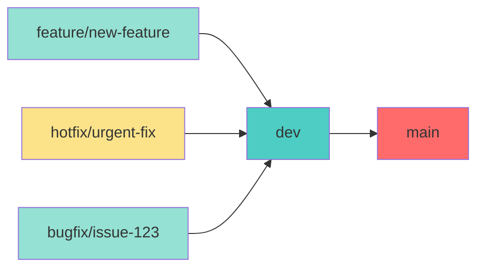

# Example GitHub Branch Protection Configuration

This file demonstrates the branch protection setup for the Apprenticeship repository.

## Current Configuration

### Protected Branch: `main`
- **Source Restriction**: Only accepts merges from `dev` branch
- **Required Reviews**: Minimum 1 approval
- **Status Checks**: Must pass `enforce-branch-protection` check
- **Force Push**: Disabled
- **Branch Deletion**: Disabled

### Workflow Example



## Branch Strategy

### Development Flow:
1. **Feature Development**: Create feature branches from `dev`
   ```bash
   git checkout dev
   git pull origin dev
   git checkout -b feature/my-new-feature
   ```

2. **Feature Integration**: Merge features into `dev`
   ```bash
   # Create PR: feature/my-new-feature → dev
   # After review and approval, merge
   ```

3. **Release Preparation**: Merge `dev` into `main`
   ```bash
   # Create PR: dev → main
   # This is the ONLY allowed path to main
   ```

### Branch Purposes:
- **`main`**: Production-ready code, deployed to Steam Workshop
- **`dev`**: Integration branch for feature testing
- **`feature/*`**: Individual feature development
- **`hotfix/*`**: Emergency fixes (merge to dev, then dev to main)
- **`bugfix/*`**: Bug fixes (merge to dev, then dev to main)

## Enforcement Mechanisms

### 1. GitHub Actions Workflow
File: `.github/workflows/branch-protection.yml`
- **Trigger**: Pull requests to `main`
- **Check**: Validates source branch is `dev`
- **Action**: Blocks non-dev merges, adds explanatory comment

### 2. GitHub Branch Protection (Manual Setup)
Settings: Repository → Branches → Branch protection rules
- **Required status checks**: `enforce-branch-protection`
- **Required reviews**: 1 approval minimum
- **Dismiss stale reviews**: Yes
- **Up-to-date requirement**: Yes

### 3. API Automation Script
File: `scripts/setup-branch-protection.js`
- **Purpose**: Automate branch protection setup
- **Requirements**: GitHub token with repo admin permissions
- **Usage**: `npm run setup` in scripts directory

## Testing the Protection

### Valid Scenarios ✅
1. **Feature to Dev**:
   ```bash
   # ✅ Allowed
   feature/user-auth → dev
   ```

2. **Dev to Main**:
   ```bash
   # ✅ Allowed (only allowed path to main)
   dev → main
   ```

### Invalid Scenarios ❌
1. **Direct Feature to Main**:
   ```bash
   # ❌ Blocked by branch protection
   feature/user-auth → main
   ```

2. **Direct Hotfix to Main**:
   ```bash
   # ❌ Blocked by branch protection
   hotfix/critical-bug → main
   ```

3. **Direct Push to Main**:
   ```bash
   # ❌ Blocked by GitHub settings
   git push origin main
   ```

## Emergency Procedures

### Scenario: Critical hotfix needed immediately

**Option 1: Follow Normal Process (Recommended)**
```bash
git checkout main
git pull origin main
git checkout -b hotfix/critical-issue
# Make fixes
git push origin hotfix/critical-issue
# Create PR: hotfix/critical-issue → dev
# After merge: Create PR: dev → main
```

**Option 2: Emergency Override (Admin Only)**
1. Temporarily disable branch protection
2. Apply hotfix directly to main
3. Re-enable branch protection  
4. **IMPORTANT**: Merge main changes back to dev
   ```bash
   git checkout dev
   git merge main
   git push origin dev
   ```

## Monitoring and Maintenance

### Regular Checks:
- [ ] Verify branch protection rules are active
- [ ] Review merge history for compliance
- [ ] Update documentation when workflow changes
- [ ] Train team members on new procedures

### GitHub Actions Logs:
- Monitor workflow runs for protection violations
- Review comments on blocked PRs
- Ensure status checks are passing

### Branch Synchronization:
- Regularly merge main back to dev if hotfixes were applied
- Keep feature branches updated with dev
- Clean up merged branches periodically

## Benefits of This Setup

### Security Benefits:
- **Prevents accidental direct commits** to production branch
- **Enforces code review** for all production changes
- **Maintains audit trail** of all changes to main branch
- **Reduces deployment risks** through controlled workflow

### Development Benefits:
- **Clear workflow** that all team members can follow
- **Integration testing** in dev before production
- **Rollback capability** through structured branching
- **Continuous integration** friendly structure

### Operational Benefits:
- **Automated enforcement** reduces human error
- **Self-documenting** process through PR history
- **Steam Workshop integration** works seamlessly
- **Hotfix support** while maintaining protection