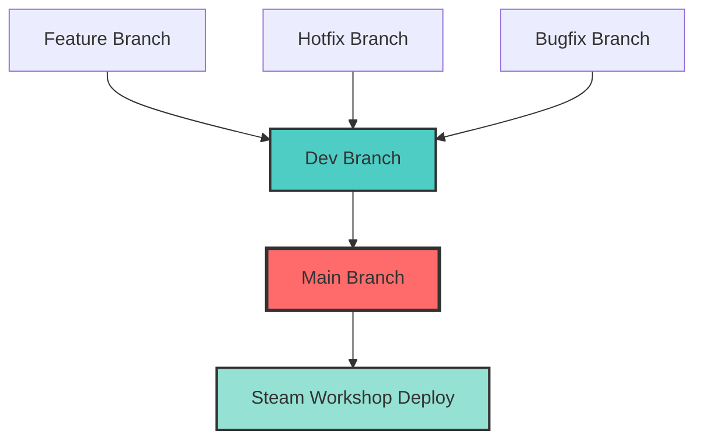

# GitHub Branch Protection Implementation

This repository implements a comprehensive GitHub branch protection system that ensures **only the `dev` branch can be merged into `main`**.

## 🎯 Objective

Prevent direct commits and unauthorized merges to the main branch while maintaining a clear development workflow.

## 🛡️ Protection Methods

### 1. Automated Enforcement (GitHub Actions)
- **File**: `.github/workflows/branch-protection.yml`
- **Trigger**: Any pull request to `main` branch
- **Action**: Blocks non-dev PRs with explanatory comments

### 2. Manual Setup (GitHub UI)
- **Guide**: `BRANCH_PROTECTION.md`
- **Method**: Repository Settings → Branches → Protection Rules
- **Benefit**: Native GitHub integration with admin controls

### 3. API Automation (Script)
- **File**: `scripts/setup-branch-protection.js`
- **Usage**: One-command setup with GitHub token
- **Benefit**: Reproducible configuration for multiple repositories

## 🚀 Quick Start

### Option A: Use GitHub Actions (Recommended)
The branch protection workflow is already configured! It will automatically:
- Block pull requests from non-dev branches to main
- Add helpful comments explaining the correct workflow
- Allow normal development on all other branches

### Option B: Full GitHub Protection Setup
```bash
# 1. Install dependencies
cd scripts
npm install

# 2. Configure GitHub token
cp .env.example .env
# Edit .env with your GitHub token

# 3. Run automated setup
npm run setup

# 4. Test the logic
npm test
```

### Option C: Manual GitHub UI Setup
Follow the detailed guide in `BRANCH_PROTECTION.md`

## 📋 Workflow



### Allowed Merges ✅
- `feature/*` → `dev`
- `hotfix/*` → `dev` 
- `bugfix/*` → `dev`
- **`dev` → `main`** (Only path to production!)

### Blocked Merges ❌
- Any branch → `main` (except `dev`)
- Direct commits to `main`

## 📁 File Overview

| File | Purpose |
|------|---------|
| `BRANCH_PROTECTION.md` | Complete setup guide |
| `BRANCH_PROTECTION_EXAMPLE.md` | Detailed workflow examples |
| `.github/workflows/branch-protection.yml` | Automated enforcement |
| `scripts/setup-branch-protection.js` | API automation |
| `scripts/test-branch-protection.js` | Logic validation |
| `.gitignore` | Exclude dependencies/secrets |

## 🧪 Testing

### Validate Logic
```bash
cd scripts
npm test
```

### Test in Practice
1. Create a feature branch: `git checkout -b feature/test-protection`
2. Try to create PR to main → Should be blocked
3. Create PR to dev → Should be allowed
4. Merge dev to main → Should be allowed

## 🔧 Configuration

### Required Permissions
- **Repository Admin**: To set up branch protection rules
- **GitHub Token**: `repo` scope for API automation
- **GitHub Actions**: Enabled for automated enforcement

### Customization
Edit these files to customize behavior:
- **Branch names**: Update `scripts/setup-branch-protection.js`
- **Workflow logic**: Modify `.github/workflows/branch-protection.yml`
- **Required reviews**: Adjust in GitHub UI or API script

## 🚨 Emergency Procedures

### Critical Hotfix Needed
1. **Preferred**: Create hotfix branch → merge to dev → merge dev to main
2. **Emergency**: Temporarily disable protection → apply fix → re-enable → sync dev

### Branch Out of Sync
```bash
# Keep dev updated with main after hotfixes
git checkout dev
git merge main
git push origin dev
```

## 🎉 Benefits

- **🛡️ Security**: Prevents accidental production deployments
- **🔍 Audit Trail**: All main changes go through documented process  
- **⚡ Automation**: Reduces manual oversight requirements
- **📚 Documentation**: Clear workflow for all team members
- **🔄 CI/CD Friendly**: Works with existing Steam Workshop deployment

## 📞 Support

### Issues with Protection
1. Check GitHub Actions logs for workflow details
2. Verify repository permissions and settings
3. Review documentation for troubleshooting steps

### Need Different Workflow?
The protection system is configurable:
- Modify allowed source branches in the workflow
- Adjust required reviewers in GitHub settings
- Update automation scripts for different repositories

---

**🔐 This protection system ensures code quality and deployment safety while maintaining development flexibility.**