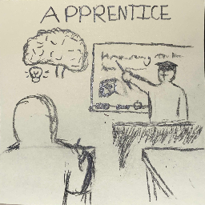

# Apprenticeship



**A Project Zomboid multiplayer mod that enables players to learn skills from each other through proximity-based teaching.**

[](https://steamcommunity.com/sharedfiles/filedetails/?id=3285160052)

## Overview

Apprenticeship transforms the multiplayer experience in Project Zomboid by allowing skilled players to passively teach their companions. When a player gains experience in a skill, nearby players automatically receive a portion of that XP, simulating the natural learning that occurs when watching and working alongside an expert.

## Key Features

### 🎓 Passive Teaching System
- **Automatic XP Sharing**: When a player gains XP in any skill, nearby players within configurable distance automatically receive XP
- **Proximity-Based**: Teaching occurs when players are within the specified range (default: 5 tiles)
- **Real-Time Learning**: Students learn as teachers perform actions and gain experience
- **Visual Feedback**: Optional halo text displays teaching/learning status above player heads

### 🏆 Character Traits

Five new traits modify teaching and learning effectiveness:

**Positive Traits:**
- **Savant** (+1 point): Enhanced teaching for boosted skills - Students gain 3x more XP when learning your specialty
- **Professor** (+3 points): Master educator - Students gain 3x more XP when learning any skill from you

**Negative Traits:**
- **Bad Teacher** (-1 point): Poor instruction - Students only gain 1/8th normal XP from you
- **Class Dismissed** (-3 points): You refuse to teach anyone anything - No teaching capability
- **Dunce** (-4 points): Cannot learn from others - Blocks all XP gain from the apprenticeship system

### ⚙️ Extensive Configuration

Server administrators have granular control through sandbox options:

**Distance & XP Settings:**
- Max teaching distance (0-100 tiles, default: 5)
- Base XP share ratio (default: 1/5 of gained XP)
- Trait-specific XP multipliers for Savant, Professor, and Bad Teacher

**Skill Category Toggles:**
- Disable entire skill categories (Passive, Agility, Combat, Crafting, Firearms, Survivalist)
- Disable individual skills within categories
- Passive skills disabled by default (Fitness, Strength)
- Firearms skills disabled by default (Aiming, Reloading)

**Quality of Life:**
- Hide teacher/student halo text notifications
- Student boredom reduction when learning passionate skills (with boost multipliers)

## How It Works

1. **Teacher gains XP**: A player performs an action that grants skill XP (e.g., cutting a tree, cooking food)
2. **Proximity check**: The system identifies all players within the configured distance
3. **Trait evaluation**: Teacher and student traits modify the XP amount
4. **XP transfer**: Nearby players receive a calculated portion of the XP
5. **Feedback**: Optional visual notifications appear above players' heads

### XP Calculation

Base formula: `Student XP = Teacher XP Gain ÷ Teaching Amount`

Modified by:
- **Savant trait**: Divides by 3 instead of default (for boosted skills only)
- **Professor trait**: Divides by 3 instead of default (all skills)
- **Bad Teacher trait**: Divides by 8 instead of default
- **Student with matching passion**: Reduces boredom by configurable amount

## Installation

### Steam Workshop (Recommended)
1. Subscribe to the [Apprenticeship mod on Steam Workshop](https://steamcommunity.com/sharedfiles/filedetails/?id=3285160052)
2. The mod will automatically download and install
3. Enable it in your mod list before starting a game

### Manual Installation
1. Download the latest release from the [GitHub repository](https://github.com/KegenGuyll/Apprenticeship)
2. Extract to `%USERPROFILE%\Zomboid\mods\` (Windows) or `~/Zomboid/mods/` (Linux/Mac)
3. Enable "Apprenticeship" in the mod list

## Configuration

### For Server Administrators

Access sandbox options when creating a new game or server:

1. Navigate to Sandbox Options → Apprenticeship
2. Configure teaching distance and XP ratios
3. Enable/disable specific skills or entire categories
4. Adjust trait multipliers to balance gameplay

### Recommended Settings

**Cooperative PvE Server:**
- Max Distance: 5-10 tiles
- Default Teaching Amount: 5 (1/5 XP share)
- All categories enabled except Firearms

**Hardcore Server:**
- Max Distance: 3-5 tiles
- Default Teaching Amount: 8-10 (lower XP share)
- Passive skills disabled
- Consider disabling Combat skills

## Compatibility

- **Project Zomboid Version**: Build 41
- **Game Mode**: Multiplayer (designed for co-op servers)
- **Mod Conflicts**: None known - should be compatible with most other mods

## Technical Details

### File Structure
```
Contents/mods/apprenticeship/
├── media/
│   ├── lua/
│   │   ├── client/          # Client-side XP sharing logic
│   │   ├── server/          # Server-side command handling
│   │   └── shared/          # Traits, options, translations
│   ├── sandbox-options.txt  # Configuration definitions
│   └── ui/                  # UI resources
├── mod.info                 # Mod metadata
└── poster.png              # Workshop banner
```

### Architecture
- **Client-Server Model**: Uses Project Zomboid's command system for synchronized XP transfers
- **Event-Driven**: Hooks into the `AddXP` event to intercept skill gains
- **Trait System Integration**: Leverages the game's TraitFactory for custom traits

## Contributing

Contributions are welcome! Please visit the [GitHub repository](https://github.com/KegenGuyll/Apprenticeship) to:
- Report bugs or issues
- Suggest new features
- Submit pull requests

## License

This mod is open source and available under the terms specified in the repository.

## Credits

- **Author**: KegenGuyll
- **Steam Workshop ID**: 3285160052
- **Repository**: https://github.com/KegenGuyll/Apprenticeship

## Support

For bug reports, feature requests, or questions:
- Open an issue on [GitHub](https://github.com/KegenGuyll/Apprenticeship/issues)
- Comment on the [Steam Workshop page](https://steamcommunity.com/sharedfiles/filedetails/?id=3285160052)
